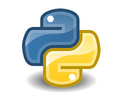

name: title_inversed_whiteText
layout: false
class: title

<h1> Docker and Python <center> <table style="background-color: white" >
<tr>
<!-- <td style="background-color: white; text-align: right" >.image-tiny[]</td> -->
<td style="background-color: white; text-align: right" >  </td>
<!-- <td style="background-color: white" >.image-tiny[]</td> -->
<td style="background-color: white; text-align: left" >  </td>
</tr> </table> </center> </h1>

3 juillet 2017, RMLL St-Etienne, Michael Bright

<div class="footnote"> <table> <tr>
    <td style="background-color: white" >  @mjbright </td>
    <td width="68%" style="color: #66c; opacity: 0; width=50%" ></td>
    <td style="background-color: white; text-align: right" >  </td>
</tr> </table> </div>


???
SpeakerNotes:

Introduce ourselves.

Why this presentation?

---
name: title_inversed_whiteText
layout: false

## Agenda

<br/>
<br/>
<br/>
- Running Python apps under Docker

- The Docker API

- Docker-machine from Python

- docker-py: Controlling Docker from Python

- Other Modules

- Ansible Container


<div class="footnote"> <table> <tr> <td style="background-color: white" >  </td> <td style="color: #66c; background-color: white" >@mjbright</td> </tr> </table> </div>

???
SpeakerNotes:

---
name: title_inversed_whiteText
layout: false

## Running Python apps under Docker

<br/>
Of course we can run any app under Docker - Python or not.

<br/>
This can be a very useful alternative to virtualenv
- complete filesystem isolation allowing to have complex dependancies beyond Python itself
- launch multiple instances of a Python process in isolation
  - isolated filesystem, process space, ports
- pull existing images of applications, frameworks
- build upon existing images and push the results to share
- can compose complex applications from multiple containers


<div class="footnote"> <table> <tr> <td style="background-color: white" >  </td> <td style="color: #66c; background-color: white" >@mjbright</td> </tr> </table> </div>

???
SpeakerNotes:

---
name: title_inversed_whiteText
layout: false

## Running Python apps under Docker -2

<br/>
What "standard" images exist on the Docker Hub? [hub.docker.com](https://hub.docker.com/)
- Python : [ "python" ](https://hub.docker.com/_/python/)
  - small, large base images
  - based on Debian, Alpine (& even WindowsServerCore !)
  - Python **2.x** [*2.7.13*], **3.x** [*3.3.6, 3.4.6, 3.5.3, 3.6.1, 3.6.2rc1*]
<br/>
- Frameworks:
    - Flask
    - Cherrypy
    - Django
    - ...


<div class="footnote"> <table> <tr> <td style="background-color: white" >  </td> <td style="color: #66c; background-color: white" >@mjbright</td> </tr> </table> </div>

???
SpeakerNotes:

---
name: title_inversed_whiteText
layout: false

## The Docker API

<br/>
<br/>
Let's take a look at how the docker command-line client makes use of the docker API to perform requests

Can we make our own command-line requests using curl?


<div class="footnote"> <table> <tr> <td style="background-color: white" >  </td> <td style="color: #66c; background-color: white" >@mjbright</td> </tr> </table> </div>

???
SpeakerNotes:

---
name: title_inversed_whiteText
layout: false

## Docker-machine from Python

<br/>
<br/>
There are many docker-related modules available in Python.

<br/>
Let's first look at "docker-machine" which provides a simple-\* encapsulation around the docker-machine executable.

<br/>
\* - a bit too simple: if docker-machine issues a prompt you will not be informed (problem with Azure login).

<br/>
Nevertheless it provides a nice wrapper enabling to simply fire up Docker hosts and pass their config to the docker-py client.


<div class="footnote"> <table> <tr> <td style="background-color: white" >  </td> <td style="color: #66c; background-color: white" >@mjbright</td> </tr> </table> </div>

???
SpeakerNotes:

---
name: title_inversed_whiteText
layout: false

## Docker-machine from Python - 2

<br/>
<br/>
**Installing** the module:

From local repo (modified to work with docker-py v2)

<code>
git clone https://github.com/mjbright/python-docker-machine

python setup.py install
</code>

<br/>
<br/>
**Initializing** the module:

<code>
import machine

import docker

m = machine.Machine(path="/usr/local/bin/docker-machine")
</code>

<div class="footnote"> <table> <tr> <td style="background-color: white" >  </td> <td style="color: #66c; background-color: white" >@mjbright</td> </tr> </table> </div>

???
SpeakerNotes:

---
name: title_inversed_whiteText
layout: false

## Docker-machine from Python - 3

<br/>
<br/>
**Using** the module:


<code>
m.create('test-machine', driver='virtualbox', blocking=True)

m.ls()

client = docker.DockerClient(**m.config(machine='test-machine'))

m.rm(machine='test-machine')
</code>


<div class="footnote"> <table> <tr> <td style="background-color: white" >  </td> <td style="color: #66c; background-color: white" >@mjbright</td> </tr> </table> </div>

???
SpeakerNotes:

---
name: title_inversed_whiteText
layout: false

## docker-py: Controlling Docker from Python

<br/>
<br/>

This module, [github.com/docker/docker-py](https://github.com/docker/docker-py) is maintained by the Docker team.

**NOTE**: Now called "**docker**", use "*pip install docker*", not *docker-py*.

Currently at the 2.4.2 release it has 2 apis
- a [low-level '*docker.APIClient*' api](https://docker-py.readthedocs.io/en/stable/api.html)
  - with operations corresponding to the Docker api
      - e.g. "create_container", "inspect_container", ...
- a [higher-level '*docker.Client*'](https://docker-py.readthedocs.io/en/stable/) object-oriented api
  - objects similar to *new* (> 1.13) "docker" client commands
      - e.g. "docker.containers.create", "docker.images.list"


<div class="footnote"> <table> <tr> <td style="background-color: white" >  </td> <td style="color: #66c; background-color: white" >@mjbright</td> </tr> </table> </div>

???
SpeakerNotes:

---
name: title_inversed_whiteText
layout: false

## Other Modules

There are many docker related Python modules, "pip3 search docker" gives 443 entries of which 217 have docker in the title, including:

- **build tools**
  - e.g. docker-build-tool, whalelinter, grocker
- alternative **API clients** 
  - e.g. aiodockerpy, docker-map, python-dockercloud
- Docker based **utilities**
  - e.g. docker-cleaner, docker-scripts, dockeranalyser
- **Monitoring** tools
  - e.g. check_docker, dockermon
- **CI** tools
  - e.g. travis2docker, 

<div class="footnote"> <table> <tr> <td style="background-color: white" >  </td> <td style="color: #66c; background-color: white" >@mjbright</td> </tr> </table> </div>

???
SpeakerNotes:

---
name: title_inversed_whiteText
layout: false

## Ansible Container

Provides a useful abstraction for building and running containers using the Ansible Configuration Management tool.


<!-- .image-medium[] -->

<br/>
<br/>
Image from: https://tech.napsty.com

<div class="footnote"> <table> <tr> <td style="background-color: white" >  </td> <td style="color: #66c; background-color: white" >@mjbright</td> </tr> </table> </div>

---
name: title_inversed_whiteText
layout: false

## Ansible Container

**Install:** - ```pip install ansible-container```

**Initialize** a new project: generates yaml template files
- ```ansible-container init```

Modify yaml files as needed for your project, then **build**:
- ```ansible-container --debug build```

Run:
- ```ansible-container run```

When ready **upload** container images to your configured registry:
- ```ansible-container shipit```

<div class="footnote"> <table> <tr> <td style="background-color: white" >  </td> <td style="color: #66c; background-color: white" >@mjbright</td> </tr> </table> </div>

???
SpeakerNotes:

---
name: title_inversed_whiteText
layout: false

## Questions?


<div class="footnote"> <table> <tr> <td style="background-color: white" >  </td> <td style="color: #66c; background-color: white" >@mjbright</td> </tr> </table> </div>

???
SpeakerNotes:

---
name: title_inversed_whiteText
layout: false

## Resources

<table style="width:100%; border: 1px solid black; background-color: #f1f1c1;">
  <tr> <th>Resource</th> <th>Docs</th> <th>Github</th> </tr>
<tbody text-align="true">
<tr><td> Running Python under Docker </td><td></td><td> <a href=""> </a> </td></tr>
<tr><td> Docker-py </td><td><a href="https://docker-py.readthedocs.io/en/stable/api.html"> docker-py.readthedocs.io</a></td><td> <a href="https://github.com/docker/docker-py"> docker/docker-py </a> </td></tr>

<!-- <tr style="background-color: #818181;"> <td>.</td><td> </td><td> </td></tr> -->
<tr><td> Docker Maps </td><td></td><td> <a href="https://www.xxx.com//"></a> </td></tr>
<tr><td> Ansible Container </td><td><a href="https://www.ansible.com/ansible-container"> ansible.com/anisble-container</a></td><td> <a href="https://github.com/ansible/ansible-container"> ansible/ansible-container </a></td></tr>

</tbody>
</table>


<div class="footnote"> <table> <tr> <td style="background-color: white" >  </td> <td style="color: #66c; background-color: white" >@mjbright</td> </tr> </table> </div>

???
SpeakerNotes:

